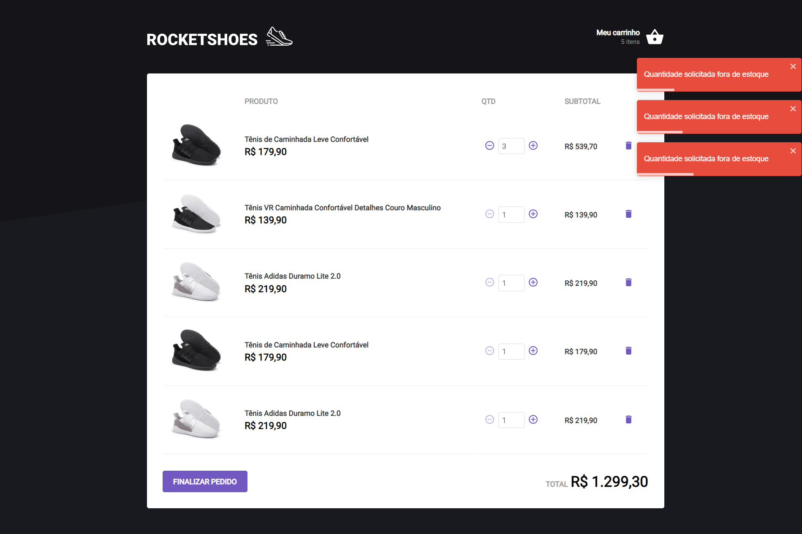

# dt money

<p>
  
  
  <a href="https://opensource.org/licenses/MIT">
    
  </a>
  
</p>


## Tópicos

[About rocketshoes](#about-rocketshoes)

[Tecnologies](#tecnologies)

[Installation](#installation)

[License](#License)

<br>

## About rocketshoes

Rocketshos is a Netshoes clone for practice hooks. In this project: ContextApi, UseState, FakeApi, CRUD and etc...

<br>

<p align="center">
  
  
</p>

## Tecnologies

Tecnologies:

- [React](https://reactjs.org/)
- [TypeScript](https://www.typescriptlang.org/)
- [Styled Components](https://styled-components.com/)
- [MirageJS](https://miragejs.com/)
- [Axios](https://github.com/axios/axios)

<br>

## Installation

```bash
# Abra um terminal e copie este repositório com o comando
git clone https://github.com/martins-rafael/dtmoney.git
# ou use a opção de download.

# Entre na pasta web com
cd dtmoney

# Instale as dependências
yarn install

# Rode a aplicação
yarn start
```

<br>

## License

<a href="https://opensource.org/licenses/MIT">
    
</a>

<br>

---

Feito com :orange_heart: by [Mohamed Schuster](https://github.com/mohamedstt)
